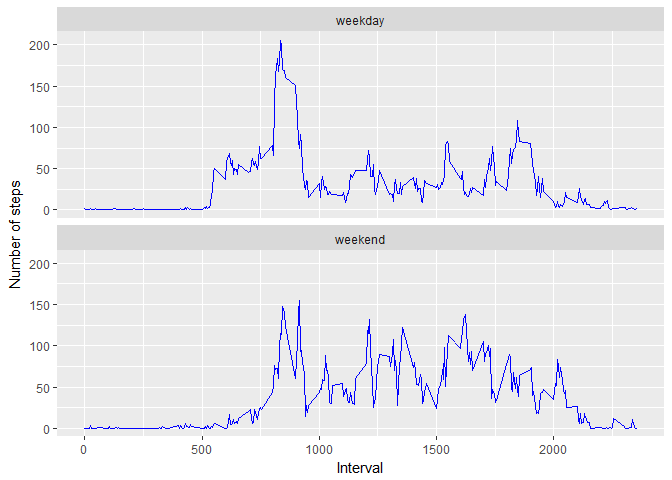

# Reproducible Research: Peer Assessment 1


## Loading and preprocessing the data

The following code is needed to load the activity.csv dataset.


```r
activity <- read.csv("activity.csv")
activity$date <- as.Date(as.character(activity$date), "%Y-%m-%d")
dailystep <- aggregate(activity$steps, by=list(activity$date), FUN=sum)
intervalstep <- aggregate(activity$steps, by=list(activity$interval), FUN=mean, 
                          na.rm=TRUE)
names(dailystep) <- c("date", "steps")
names(intervalstep) <- c("interval", "steps")
```

## What is mean total number of steps taken per day?

The following shows the histogram of the average total number of steps taken 
per day.

<!-- -->

The mean of total number of steps taken per day is 
**10,766.19** 
and the median of total number of steps taken per day is 
**10,765**.

## What is the average daily activity pattern?

The following diagram shows a line plot of the 5-minute interval (x-axis) and 
the average number of steps taken, averaged across all days (y-axis).

<!-- -->

The 5-minute interval **835**, on average across all the days 
in the dataset, contains the maximum number of steps. The maximum number of step
is **206.17**.

## Imputing missing values

There are **2304** missing values in the 
dataset.  

I would like to use **the median for that 5-minute interval** for filling in all
the missing values in the dataset.  

To create the new dataset, I ran the following code. The first 20 lines of the 
result is shown at the second block.


```r
missingactivity <- activity[is.na(activity$steps),]
nonmissingactivity <- activity[!is.na(activity$steps),]
medianintervalstep <- aggregate(activity$steps, by=list(activity$interval), 
                                FUN=median, na.rm=TRUE)
names(medianintervalstep) <- c("interval", "steps")
filledactivity <- merge(x = missingactivity, y = medianintervalstep, 
                        by = "interval", all.x = TRUE)
filledactivity$steps = filledactivity$steps.y
filledactivity <- filledactivity[,c("interval","date","steps")]
filledactivity <- rbind(filledactivity, nonmissingactivity)
head(filledactivity, 20)
```

```
##    interval       date steps
## 1         0 2012-10-01     0
## 2         0 2012-11-30     0
## 3         0 2012-11-04     0
## 4         0 2012-11-09     0
## 5         0 2012-11-14     0
## 6         0 2012-11-10     0
## 7         0 2012-10-08     0
## 8         0 2012-11-01     0
## 9         5 2012-11-09     0
## 10        5 2012-10-01     0
## 11        5 2012-11-30     0
## 12        5 2012-11-04     0
## 13        5 2012-11-01     0
## 14        5 2012-11-14     0
## 15        5 2012-11-10     0
## 16        5 2012-10-08     0
## 17       10 2012-10-01     0
## 18       10 2012-11-04     0
## 19       10 2012-11-09     0
## 20       10 2012-11-14     0
```
There are **0** missing 
values in the dataset after filling missing values. 

The following shows the histogram of the average total number of steps taken 
per day (with missing value being filled).

<!-- -->

After filling the missing value, 
the mean of total number of steps taken per day changes from 
**10,766.19** to 
**9,503.87** 
and the median of total number of steps taken per day changes from
**10,765** to
**10,395**.

## Are there differences in activity patterns between weekdays and weekends?

The new factor variable **week** is created, the following shows the first 6 
records of the dataset.


```
##   interval       date steps    week
## 1        0 2012-10-01     0 weekday
## 2        0 2012-11-30     0 weekday
## 3        0 2012-11-04     0 weekend
## 4        0 2012-11-09     0 weekday
## 5        0 2012-11-14     0 weekday
## 6        0 2012-11-10     0 weekend
```

The following shows the panel plot of the 5-minute interval and the average 
number of steps taken, averaged across all weekday days or weekend days.

<!-- -->
